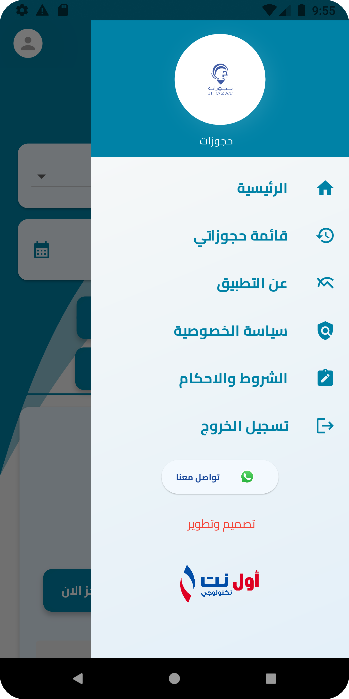
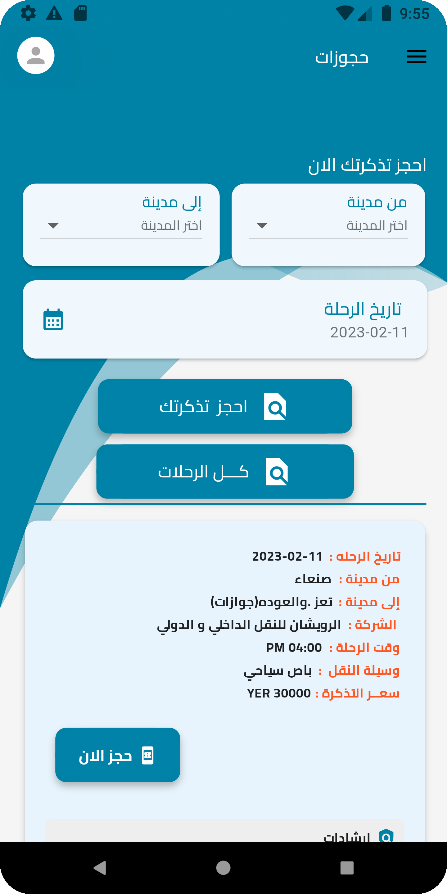

# flutter_hjozatApp

## Screenshots 📸

  
  
      
  
  

Description
A demo app that demonstrates Flutter's ability to create beautiful UI with complex animations. The app fetches recipes from local storage.

📦 Packages
Description	Package
shared_preferences	shared_preferences
State Management	Getx
animation	simple_animations
